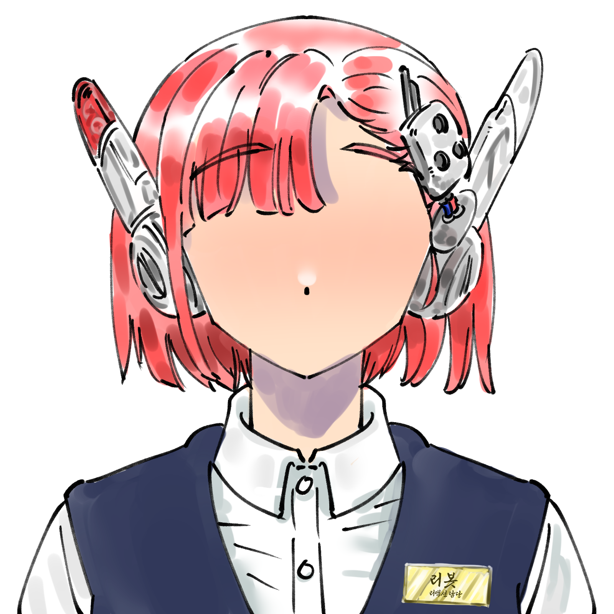

# Reaction Bot

방송하면서 내가 말하면 봇 캐릭터(기본 이름: **리봇**)가 화면을 보고 듣고 가끔 리액션해주는 시스템.

```
[내 마이크] → Python STT 워커 (VAD + faster-whisper)
              ↓ 발화 시작 → 화면 프리캡처
              ↓ 발화 끝나면 POST
            [Spring Boot] ← 프리캡처된 스크린샷 + 발화 텍스트 + 대화 히스토리
              ↓
              LLM (말할지 / PASS할지 판단)
              ↓ 말할 멘트가 있으면
              TTS → mp3 → 스피커 → OBS "데스크탑 오디오"
```

STT 워커는 서버 기동 시 **자식 프로세스로 자동 실행**됩니다. 터미널 하나로 끝.

---

## 빠른 시작

### 인스톨러 (비개발자)

1. GitHub Releases에서 `ReactionBot-Setup-x.x.x.exe` 다운로드 → **더블클릭**
   - Java 21 / Python 3 없으면 자동 설치, pip 의존성도 자동
2. 시작 메뉴 → **Reaction Bot 실행** → 브라우저에 설정 페이지 자동 오픈
3. API 키 입력 + 저장 → 재시작 → 끝

> zip 번들도 있음: `reaction-bot-x.x.x-bundle.zip` 압축 풀고 `start.bat` 실행 (Java/Python 직접 설치 필요)

### 개발 모드 (소스에서)

```powershell
gradle bootRun
```

설정은 `http://localhost:8080/config`에서 가능. OBS 연동은 브라우저 소스에 `http://localhost:8080/avatar` 추가.

---

## 필요한 것

| 항목 | 조건 |
|---|---|
| **JDK** | 21+ (Gradle toolchain이 없으면 자동 다운로드) |
| **Python** | 3.9 ~ 3.13 |
| **LLM provider** | 6종 중 택 1 (아래 참고) |
| **마이크** | OS 기본 입력 자동 인식 |

---

## 셋업

### Python 의존성

```powershell
pip install --user numpy sounddevice requests faster-whisper webrtcvad-wheels edge-tts
```

> Python 3.13이면 `webrtcvad` 대신 `webrtcvad-wheels` 포크를 써야 합니다.

### 환경변수

| 환경변수 | 용도 | 기본값 |
|---|---|---|
| `ANTHROPIC_API_KEY` | Claude API 키 | - |
| `BOT_NAME` | 봇 이름 | `리봇` |
| `STREAMER_NAME` | 스트리머 이름 | `로크만` |
| `OBS_PASSWORD` | OBS WebSocket 비밀번호 | - |

```powershell
# 영구 설정
[Environment]::SetEnvironmentVariable("ANTHROPIC_API_KEY", "sk-ant-...", "User")
```

> **Claude Pro ≠ API**: claude.ai 월 구독(Pro)과 API 크레딧은 별개입니다. console.anthropic.com에서 **API 크레딧을 따로 충전**해야 합니다 (최소 $5).

### TTS

Microsoft Edge 무료 TTS만 지원합니다. API 키 불필요. 한국어 음성 3종 (SunHi/InJoon/HyunsuMultilingual).

---

## LLM Provider

[application.yml](src/main/resources/application.yml)의 `llm.provider`:

| Provider | 비용 | 화면 인식 | 호출 패턴 | 설정 파일 |
|---|---|---|---|---|
| **anthropic** (Claude API) | ~$0.01-0.03/호출 | O | 2단계 (Haiku triage → Sonnet 생성) | [anthropic.yml](src/main/resources/anthropic.yml) |
| **gemini** (Google) | Claude의 ~1/10 | O | 2단계 (Flash-Lite triage → Flash 생성) | [gemini.yml](src/main/resources/gemini.yml) |
| **openai** (OpenAI API) | 모델별 상이 | O | 2단계 (mini triage → 생성) | [openai.yml](src/main/resources/openai.yml) |
| **ollama** (로컬) | **무료** (GPU만) | 모델에 따라 | 1단계 (triage 생략) | [ollama.yml](src/main/resources/ollama.yml) |
| **claude-cli** (Claude Code CLI) | Pro/Max 구독 내 **$0** | O | 1~2단계 | [claude-cli.yml](src/main/resources/claude-cli.yml) |
| **codex-cli** (Codex CLI) | 구독 내 **$0** / 종량 | O | 1~2단계 | [codex-cli.yml](src/main/resources/codex-cli.yml) |

### 로컬 Ollama

API 비용 없이 무제한 호출. GPU 있는 PC 권장.

```powershell
# 1) 설치: https://ollama.com/download
# 2) 모델 pull
ollama pull qwen3-vl:8b      # 비전 지원, ~5GB (추천)

# 3) application.yml
#   reaction-bot.llm.provider: ollama
#   ollama.yml에서 base-url, model, vision 설정
```

### Claude Code CLI / Codex CLI

구독(Pro/Max) 한도 안에서 호출하므로 토큰 비용 0. 사전에 CLI 설치 + 로그인 필요.

```powershell
# Claude Code
npm install -g @anthropic-ai/claude-code
claude   # 로그인

# Codex
npm install -g @openai/codex
codex login
```

---

## 실행

```powershell
gradle bootRun
```

정상 기동 로그:
```
Started ReactionBotApplication in X.X seconds
STT 워커 시작: python scripts/stt_worker.py --server-url ...
[stt] ✅ 모델 로딩 완료
[stt] 🎙️ 마이크 시작
```

마이크에 말하면:
```
[stt] 🎤 발화 감지
프리캡처 완료 (blank=false)          ← 발화 시작 시점에 화면 캡처
[stt] 📝 STT 결과 (1.8s): '안녕 리봇야'
STT 발화 수신: '안녕 리봇야'
프리캡처 사용 (age=2100ms)           ← 말하기 시작할 때의 화면을 LLM이 봄
봇 raw 응답: 어 왔어? 오랜만이네 ㅋㅋ
```

STT 워커 끄기 (마이크 없이 개발): `stt.auto-start: false`

---

## 주요 설정

모든 설정은 [application.yml](src/main/resources/application.yml) 또는 `http://localhost:8080/config` UI에서 변경.

| 설정 | 설명 | 기본값 |
|---|---|---|
| `speech.respond-only-when-addressed` | 봇 이름 호명 시에만 응답 | `false` |
| `speech.grace-period-ms` | 봇 발화 후 잔향 컷 (ms) | `800` |
| `speech.nudge-after-pass-count` | 연속 N번 PASS 후 적극성 부스트 | `2` |
| `idle-trigger.enabled` | 침묵 시 봇이 먼저 말 걸기 | `true` |
| `idle-trigger.light-threshold-ms` | LIGHT 발동 침묵 시간 | `60000` |
| `idle-trigger.topic-threshold-ms` | TOPIC 격상 침묵 시간 | `180000` |
| `llm.multimodal-mode` | vision 정책: `always` / `never` / `ai-decide` | `ai-decide` |
| `screen.source` | 화면 캡처 소스: `obs` / `robot` | `obs` |
| `stt.model` | Whisper 모델: tiny/base/small/medium/large-v3 | `small` |
| `stt.vad-aggressiveness` | VAD 민감도 0(관대)~3(엄격) | `3` |

### 캐릭터 성격

[character.yml](src/main/resources/character.yml)에서 시스템 프롬프트 수정. `{name}`, `{streamer}` placeholder 자동 치환.

---

## OBS 연동

### 음성 송출
OBS "데스크탑 오디오" 소스가 켜져 있으면 봇 음성이 자동 송출.

### 화면 캡처 (OBS WebSocket)
OBS 28+의 내장 WebSocket Server로 송출 중인 씬을 캡처:

1. OBS → Tools → WebSocket Server Settings → Enable
2. Port `4455`, 비밀번호 설정 시 `OBS_PASSWORD` 환경변수로 전달
3. [application.yml](src/main/resources/application.yml): `screen.source: "obs"` (기본값)

OBS 없이 모니터 전체 캡처: `screen.source: "robot"`

### 아바타
OBS 브라우저 소스 → `http://localhost:8080/avatar/` (너비/높이 800~1600px)

- 평소: 눈 깜박임 + idle 흔들림
- 봇 발화 중: 입 애니메이션 + 흔들림 증가

#### 기본 리봇 에셋

base.png (본체) + eye/mouth 파트를 레이어로 겹쳐서 렌더링합니다:

| base (본체) | eye-open (눈) | mouth-open (입) |
|:---:|:---:|:---:|
|  |  |  |

7장의 파트 이미지(`assets/avatar/`): base.png, mouth-{closed,half,open}.png, eye-{open,half,closed}.png. 모두 동일 캔버스 크기의 투명 PNG. 교체 시 브라우저 강력 새로고침(Ctrl+Shift+R)만으로 반영, 서버 재기동 불필요.

---

## 포켓몬 오버레이 (옵션 add-on)

발화 흐름과 분리된 별개 기능. 스크린샷에서 포켓몬을 인식해 `/pokemon-overlay` HTML 화면에 카드 형태로 띄워줌. OBS 브라우저 소스에 끼워두는 용도.

| 표시 항목 | 설명 |
|---|---|
| 한글명 + 도트 스프라이트 | PokéAPI 다국어 + 공식 도트 |
| 스피드 순위 + H/A/B/C/D/S | 세대 기준 종족값. 개체값·노력치는 알 수 없어 종족값 표시. |
| 타입 (한글) | 세대별 `past_types` 적용 |
| 약점 타입 (×2 / ×4) | `damage_relations` + `past_damage_relations`로 세대 적용. ×4는 빨간 테두리 |
| 미러전 배지 | 같은 종 2마리 이상일 때 표시 (인식 검증용) |

### 활성화

1. `/config` → "포켓몬 오버레이" 체크 → 저장
2. **서버 재기동** (설정은 기동 시 한 번 바인딩됨)
3. OBS 브라우저 소스: `http://localhost:8080/pokemon-overlay/`

### 트리거 모드 (`pokemon.overlay.mode`)

| 모드 | 동작 |
|---|---|
| `manual` (기본) | 헤더 우측 [분석] 버튼 또는 `Enter` 키로 트리거. 의도한 순간만 갱신. |
| `auto` | `refresh-interval-ms` 주기로 자동 분석. 켜두면 화면 따라 자동 갱신. |
| `speech-precapture` | 발화 시작 시점에 함께 분석 (발화 흐름의 프리캡처를 재사용). |

### 자기 오버레이 영역 마스킹

송출 화면에 오버레이가 같이 떠있으면 LLM이 자기 카드를 다시 분석하는 사고가 날 수 있음. `ignore-region`으로 해당 영역을 검정 박스로 덮어 LLM이 못 보게 함.

```yaml
reaction-bot:
  pokemon:
    overlay:
      # "x,y,w,h" 0~1 정규화 좌표. ";"로 여러 영역 가능.
      # 예: 좌측 25% 가로, 위 50% 세로를 마스킹
      ignore-region: "0,0,0.25,0.5"
```

### 수동 입력 (LLM 인식 실패 시 fallback)

URL 끝에 `?edit=1`을 붙이면 헤더 아래 입력바가 노출됨. OBS 송출 창은 `?edit` 빼고, 본인 모니터링 창만 `?edit=1`로 띄우면 됨.

```
http://localhost:8080/pokemon-overlay/?edit=1
```

- 한글/일어 카타카나/영문 슬러그 모두 입력 가능: `한카리아스, ガブリアス, garchomp`
- 콤마(또는 `、`, 줄바꿈)로 여러 마리 한 번에
- **자동완성**: 입력 중 하단에 비슷한 포켓몬 칩 표시 (`잠ㅁ` → `[잠만보]`)
  - `↑` / `↓` 칩 이동 → `Tab` / `Enter` 선택 → `Esc` 닫기
- **단축키**
  - 입력 필드 `Enter` — 활성 칩 있으면 칩 선택, 없으면 수동 적용
  - 페이지 어디서든 `Enter` — 분석 버튼 클릭 (manual 모드일 때)
  - `Shift+Enter` — 수동 적용 (입력 필드 밖에서도)
- 초기화: 입력바 우측 [초기화] 버튼

### 세대 / 카드 수

```yaml
generation: 9          # 1~9. 해당 세대 시점 종족값/타입/약점 데이터 기준
max-pokemon: 2         # 2=싱글배틀, 4=더블배틀
```

### 지원 provider

현재 `anthropic`, `claude-cli` 두 가지만 raw vision 분석 지원. 다른 provider 선택 시 카드 영역에 "현재 LLM provider는 raw vision 미지원" 안내가 뜸. (필요 시 별도 PR로 확장 가능)

### 알아둘 점

- **일어 인덱스 디스크 캐시**: 첫 기동 시 PokéAPI에 ~1300회 species 호출이 백그라운드로 들어감 (수십 초). 결과는 `./data/pokemon-name-index.json`에 저장 → **다음 기동부터는 디스크에서 즉시 로드, PokéAPI 호출 0회**. 새 세대 출시 등으로 갱신이 필요하면 파일 삭제 후 재기동, 또는 `POST /api/pokemon-overlay/rebuild-index`로 백그라운드 재빌드. 빌드 중에도 옛 인덱스로 자동완성/lookup 계속 동작.
- **세대별 종족값 override**: PokéAPI 가 종족값의 `past_values` 를 제공하지 않아 [pokemon-past-stats.json](src/main/resources/pokemon-past-stats.json)으로 수동 관리. 옛 세대 조회 시 그 시점 종족값으로 자동 덮어씀. 변경된 종만 적으면 되고(나머지는 자동으로 현재값), 일부 stat 만 적어도 됨. 파일 최상단 주석에 추가 가이드 + Bulbapedia 링크.
- **도트 폰트 인식**: 화면 텍스트가 도트(픽셀) 폰트면 LLM 인식 정확도가 떨어짐. 프롬프트가 "텍스트 무시 → 외형으로 식별"을 강제하지만, 안 잡히면 `?edit=1`로 수동 입력.
- **demo 모드**: `?demo=1` URL에서만 데모 카드(잠만보·한카리아스 등) 표시. 평소엔 절대 안 뜸. 헤더에 노란 `DEMO` 배지가 보이면 데모 상태.

---

## 엔드포인트

| Method | Path | 용도 |
|---|---|---|
| POST | `/api/react/speech` | STT 워커가 발화 전송 `{"text": "..."}` |
| POST | `/api/screen/pre-capture` | STT 워커가 발화 시작 시 화면 프리캡처 요청 |
| POST | `/api/reset` | 대화 히스토리 초기화 |
| GET | `/api/status` | 봇 상태 (발화 중 여부, 히스토리 턴 수) |
| GET | `/api/avatar/events` | 아바타 SSE 스트림 |
| GET | `/avatar/` | 아바타 HTML (OBS Browser Source URL) |
| GET | `/config/` | 설정 UI |
| GET/POST | `/api/config` | 설정 조회/저장 |
| GET | `/pokemon-overlay/` | 포켓몬 오버레이 HTML (`?edit=1`로 수동 입력 모드) |
| GET | `/api/pokemon-overlay/state` | 현재 카드 상태 (HTML 폴링) |
| POST | `/api/pokemon-overlay/analyze` | 수동 분석 트리거 |
| POST | `/api/pokemon-overlay/manual` | 수동 입력 `{"names":["한카리아스",...]}` |
| DELETE | `/api/pokemon-overlay/cards` | 카드 비우기 |
| GET | `/api/pokemon-overlay/suggest?q=...` | 자동완성 후보 |
| POST | `/api/pokemon-overlay/rebuild-index` | 일어 인덱스 강제 재빌드 (디스크 캐시 갱신) |

---

## 트러블슈팅

| 증상 | 해결 |
|---|---|
| `Your credit balance is too low` | console.anthropic.com → Plans & Billing → Add credits |
| `ModuleNotFoundError` | `pip install --user numpy sounddevice requests faster-whisper webrtcvad-wheels edge-tts` |
| `RuntimeError: cublas64_12.dll not found` | `stt.device: cpu`로 설정 (기본값) |
| `HeadlessException` | `ReactionBotApplication.java`에 `setHeadless(false)` 확인 |
| 봇이 자기 목소리에 반응 | 헤드폰 사용 권장. 또는 `speech.grace-period-ms`를 1500~2000으로 |
| OBS 캡처 실패 | OBS 실행 중 + WebSocket Server 활성화 확인 |
| PASS만 계속 | `speech.nudge-after-pass-count`를 1~2로, ollama면 `assertive: true` 확인 |

---

## 빌드 & 배포

| 명령 | 산출물 | 용도 |
|---|---|---|
| `gradle bootJar` | `build/libs/reaction-bot-x.x.x.jar` | 실행 가능 fat JAR |
| `gradle distBundle` | `reaction-bot-x.x.x-bundle.zip` | zip 배포 (`start.bat` 포함) |
| `gradle distInstaller` | `ReactionBot-Setup-x.x.x.exe` | 원클릭 인스톨러 (Inno Setup 6 필요) |

Inno Setup 설치: `winget install JRSoftware.InnoSetup`

버전 변경 시 [build.gradle](build.gradle)의 `version`과 [installer/installer.iss](installer/installer.iss)의 `MyAppVersion` 두 곳을 같이 수정.

---

## License

[MIT License](LICENSE) — Copyright (c) 2026 김주현
